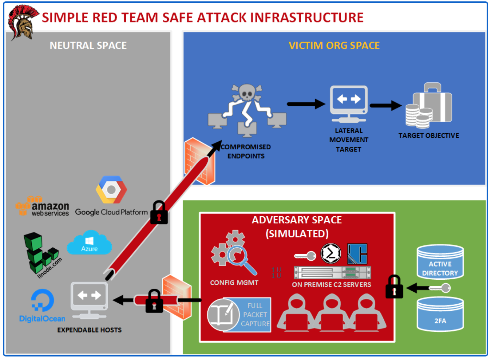

# Infraestructura de Red Team Segura (Merlin C2)

Imaginemos que no contamos con un C2, estaríamos utilizando un netcat, sin manejo de autenticación donde cualquiera podría conectarse, inmediatamente a los minutos de desplegado nuestra infraestructura recibiremos conexión de diversos escáneres en internet. 

Tampoco contamos con los principios de la seguridad CIA y surgen muchas preguntas:

* Utilizaríamos un listener en metasploit, pero de quien es la shell? 
* ¿Dónde fue disparada? 
* ¿De dónde fue realizada la conexión?
* ¿Quién tiene control del otro lado?

Como resultado:

* Necesitamos tratar la Internet abierta como un espacio disputado porque lo es.
* Nuestros listener necesitan ser salvaguardados. Los escáneres, los blue teams y otros actores de Internet  estarán molestando todo el día.
* Nuestras payloads requieren autenticación. De lo contrario, cualquiera puede lanzar una shell  y cualquiera puede atrapar una shell.
* Nuestro tráfico C2 debe ser confidencial. De lo contrario, el mundo puede ver los comandos que usemos.

Lo primero que debemos pensar al momento de iniciar el despliegue de nuestra infraestructura de ataque es el calculo del riesgo de la nube. Una infraestructura en cualquier proveedor de nube al final no estamos usando nuestros equipos, sin embargo debemos preguntarnos siempre: ¿Quién el dueño de la data?

Fuente: https://malcomvetter.medium.com/responsible-red-teams-1c6209fd43cc

Es fundamental  poder desplegar nuestra infraestructura de manera rápida, sin embargo no podemos dejar de lado las implicaciones legales, existen decretos o leyes, para la protección de datos en la nube.

En el siguiente artículo buscamos continuar con una serie de laboratorios de uno de los mejores cursos de red team que hemos tomado en los últimos meses de [https://taggartinstitute.org](https://taggartinstitute.org/courses/responsible-red-teaming/) 

##### Requerimientos

- Máquina virtual con Kali 4GB de Ram mínimo, deseable 8GB de Ram.
- [VPS con Ubuntu Server](https://www.vultr.com/?ref=7249687) con 1Gb de RAM para el C2
- Permitir reglas de entrada en los puertos 22 y 8443

##### Instalación de Merlin

##### Conclusión

* 

