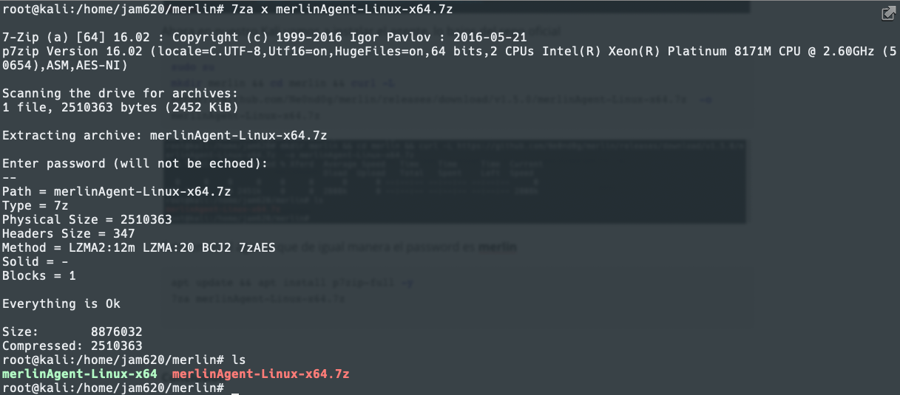

# Infraestructura de Red Team Segura (Merlin C2)

Imaginemos que no contamos con un C2, estaríamos utilizando un netcat, sin manejo de autenticación donde cualquiera podría conectarse, inmediatamente a los minutos de desplegado nuestra infraestructura recibiremos conexión de diversos escáneres en internet. 

Tampoco contamos con los principios de la seguridad CIA y surgen muchas preguntas:

* Utilizaríamos un listener en metasploit, pero de quien es la shell? 
* ¿Dónde fue disparada? 
* ¿De dónde fue realizada la conexión?
* ¿Quién tiene control del otro lado?

Como resultado:

* Necesitamos tratar la Internet abierta como un espacio disputado porque lo es.
* Nuestros listener necesitan ser salvaguardados. Los escáneres, los blue teams y otros actores de Internet  estarán molestando todo el día.
* Nuestras payloads requieren autenticación. De lo contrario, cualquiera puede lanzar una shell  y cualquiera puede atrapar una shell.
* Nuestro tráfico C2 debe ser confidencial. De lo contrario, el mundo puede ver los comandos que usemos.

Lo primero que debemos pensar al momento de iniciar el despliegue de nuestra infraestructura de ataque es el calculo del riesgo de la nube. Una infraestructura en cualquier proveedor de nube al final no estamos usando nuestros equipos, sin embargo debemos preguntarnos siempre: ¿Quién el dueño de la data?


Fuente: https://malcomvetter.medium.com/responsible-red-teams-1c6209fd43cc

Es fundamental  poder desplegar nuestra infraestructura de manera rápida, sin embargo no podemos dejar de lado las implicaciones legales, existen decretos o leyes, para la protección de datos en la nube.

En el siguiente artículo buscamos continuar con una serie de laboratorios de uno de los mejores cursos de red team que hemos tomado en los últimos meses de [https://taggartinstitute.org](https://taggartinstitute.org/courses/responsible-red-teaming/) 

##### Requerimientos

- Máquina virtual con Kali 4GB de Ram mínimo, deseable 8GB de Ram.
- [VPS con Ubuntu Server](https://www.vultr.com/?ref=7249687) con 1Gb de RAM para el C2
- Permitir reglas de entrada en los puertos 22 y 8443


##### Instalación de Merlin

Vamos a proceder a instalar el C2 Server en la nube utilizando ubuntu server 20.04 como base

```shell
sudo su
apt update && apt install p7zip-full -y
```


Verificamos que se instalara correctamente la herramienta

`7za`


Vamos a crear un directorio de trabajo donde vamos a descargar el compilado del C2

```shell
mkdir merlin && cd merlin && curl -L  https://github.com/Ne0nd0g/merlin/releases/download/v1.5.0/merlinServer-Linux-x64.7z -o merlinServer-Linux-x64.7z
```


Vamos a descomprimir, el password es **merlin**

```shell
7za x merlinServer-Linux-x64.7z
```


Comprobamos que este el ejecutable y ejecutamos el server C2


Debes aparecernos el prompt del c2


Ahora en nuestro Kali vamos a instalar el agente, lo bajos del repo oficial

```shell
sudo su
mkdir merlin && cd merlin && curl -L https://github.com/Ne0nd0g/merlin/releases/download/v1.5.0/merlinAgent-Linux-x64.7z  -o merlinAgent-Linux-x64.7z
```


Extraemos el agente que de igual manera el password es **merlin**

```shell
apt update && apt install p7zip-full -y 
7za merlinAgent-Linux-x64.7z

```



Ejecutamos el agente y verificamos la version

```shell
./merlinAgent-Linux-x64 -version
```


##### Configuración de Sesión Merlin

Procedemos a configurar un listener en el servidor c2  de la siguiente manera


Vamos a ejecutar el listener, pero debemos observar que podemos cambiar la llave PSK, en estos momentos es merlin pero vamos  a modificarla antes de iniciar


Iniciamos el listener 


Para la conexión al ser un listener usando http, utilizaremos la url, desde el kali

```shell
./merlinAgent-Linux-x64 -url http://20.100.202.220:8443 -psk Toadec -padding 0 --sleep 5s -skew 0 -proto http -v
```


Si establecemos sesión debe aparecernos d ella siguiente manera, en el lado izquierdo observamos la autenticación fue exitosa


##### Autenticación, Confidencialidad  e Integridad

Merlin tiene la ventaja de ser considerado criptográficamente seguro por la combinación de 3 protocolos. 

- [OPAQUE:](https://posts.specterops.io/merlin-goes-opaque-for-key-exchange-420db3a58713) es un sistema criptográfico diseñado para permitir el intercambio seguro de claves sin el uso de una infraestructura de clave pública. Esto significa que puede convertir una clave precompartida (PSK) en un sistema protegido criptográficamente.

  

- JWE: La confidencialidad de los mensajes es crucial para las operaciones. Merlin tiene múltiples protocolos que pueden transmitir mensajes. Cada protocolo protege los mensajes mediante el uso de JSON Web Encryption.

  Luego que OPAQUE crea una llave simétrica, esta llave es utilizada para cifrar cada mensaje que es enviado al agente. El formato es similar al siguiente:

  

  De manera que el manseja debe lucir como esto:
  

- [JWT](https://blog.toadsec.io/2021/05/05/JWT-101.html): Merlin combate la inyección de mensajes y el acceso no autorizado al listerner mediante JSON Web Tokens. Un listener de Merlin solo responderá a un mensaje que tenga al menos un JWT en su encabezado de autorización. El valor de JWT debe coincidir con uno que se creó en el registro del agente para que se acepte y procese un mensaje. Todos los demás mensajes se descartan con un error 400 o 404.

##### PRISM: Responsabilidad como Código

Básicamente versiones anteriores de Merlin, incluían una herramienta llamada PRISM, debido a que  desde la versión 0.8.0 la contraseña default  de Merlin es **merlin**, en algunos casos como el nuestro la modificamos pero aquellos operatos que inician en el mundo de red team pueden omitir cambiarla. Por ende PRISM se implemento en la versión **v0.9.0-beta** vamos a probarla 

```shell
mkdir merlin-old && cd merlin-old && curl -L https://github.com/Ne0nd0g/merlin/releases/download/v0.9.0-beta/merlinServer-Linux-x64.7z -o merlinServer-Linux-x64.7z
```


Comprobamos la versión

```shell
./merlinServer-Linux-x64  -version
```


Vamos a ponerla en escucha y configurarla igual que el anterior, solamente que en la conexión modificaremos la clave en el agente


Si utilizamos la misma PSK anterior nos arrojara un error


Vamos a utilizar ahora uno con la PSK correcta, pero nos arrojará otro error debido a que el agente no es el esperado y no contiene el fingerprints que identifique al agente correctamente.


##### Conclusión

* Hemos comprobado que Merlin permite configuraciones que herramientas como metasploit y meterpreter por defecto no traen, como son la autenticación y el cifrado, no obstante a pesar que podemos limitar los ip que puedan accede a los listener en metasploit, esto no quiere decir que usuarios indebidos no puedan accesar a nuestros listeners. 
* Merlin con su herramienta de PRISM lleva un poco más adelante la seguridad al tener payload con autenticación, de esta manera solamente los agentes y los listones establecen sesiones con la llave PSK en ambos lados.
* Contamos con un intercambio seguro de llaves y mensajes con OPAQUE y JWE.
* Por último mantenemos la integridad de los mensajes forzando el uso de JWT.

En entregas siguientes enseñaremos como podemos utilizar redirectors que nos permitirán desplegar nuestro C2 On-premise y disminuir nuestra superficie de ataque manteniendo la data en nuestros servidores.

